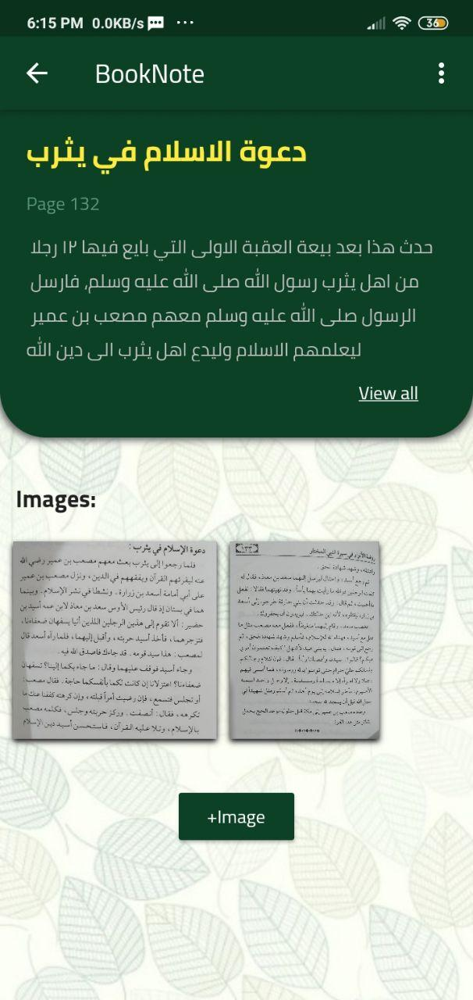

# booknote

It's a Mobile appliction which is very useful for peopole who read, it helps you to keep the information that you gained safe and organised in one place in case you want to read them again

## Tools and technologies
- Flutter
- Android studio IDE
- Sqlite
## Screenshots 

## Software Design
The app isn't big so its design isn't very big, it only contains 4 classes

